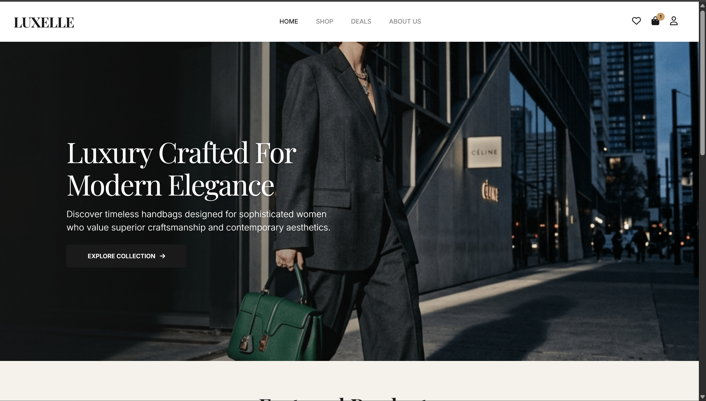
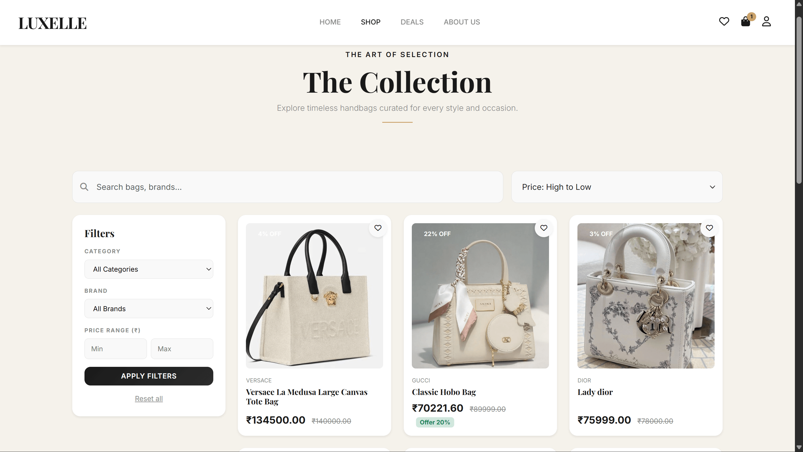
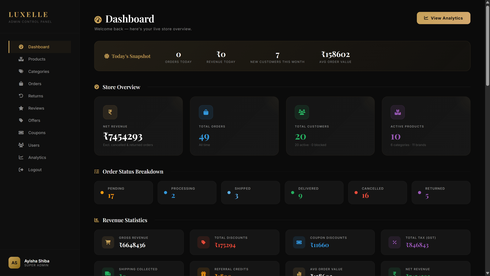

# 👜 Luxelle


## Overview

**Luxelle** is a full-stack luxury handbag e-commerce platform built with **Django**, designed to deliver a seamless and secure online shopping experience. Customers can browse premium handbags, discover products through advanced filtering, securely place orders, manage their accounts, and track purchases. The platform also provides a powerful admin dashboard for managing products, inventory, customers, orders, and business operations efficiently.

---

# 📸 Screenshots

<!-- Replace these placeholder paths with your actual screenshot filenames inside the /screenshots folder -->

### 🏠 Homepage


### 🛍️ Product Listing & Filtering

<!-- 
### 📄 Product Detail Page

<! 
### 🛒 Cart & Checkout

 -->
<!-- ### 📦 Order Tracking
 -->
 
### 🧑‍💼 Admin Dashboard


<!-- ### 📊 Sales Analytics
 -->

<details>
<summary>📁 More Screenshots</summary>

| Wishlist | Reviews & Ratings |
|----------|--------------------|
|  |  |

| Coupon Management | Inventory Management |
|--------------------|------------------------|
|  |  |

</details>

---

# 🌟 Key Features

## For Customers

### Secure Authentication

* User registration and login
* Google OAuth authentication
* Phone OTP login
* Email verification
* Password reset via email
* User profile management
* Multiple address management

### Intuitive Shopping Experience

* Browse luxury handbags and clutches
* Product search and advanced filtering
* Category and variant selection
* High-quality product image gallery
* Recently viewed products
* Wishlist management
* Customer reviews and ratings

### Seamless Checkout Process

* Shopping cart management
* Coupon application
* Secure Razorpay payment integration
* Order placement
* Invoice generation
* Order tracking
* Order cancellation
* Product return requests
* Wallet refund management

---

## For Administrators

### Comprehensive Admin Panel

* Interactive dashboard with sales analytics
* Revenue and order statistics
* Customer management
* Order processing and status updates
* Review moderation
* Coupon management
* Promotional offer management

### Inventory & Product Management

* Product catalog management
* Category management
* Variant management
* Inventory and stock control
* Product image management

---

# 🛠 Tech Stack

## Backend

* Python 3.11+
* Django 5.x
* Django REST Framework
* PostgreSQL

## Frontend

* HTML5
* CSS3
* Bootstrap 5
* JavaScript
* Django Templates

## Authentication

* Django Authentication
* Google OAuth
* Email Verification
* Phone OTP Authentication

## Payment Gateway

* Razorpay

## Cloud Storage

* AWS EC2
* AWS S3
* Nginx
* Gunicorn
* PostgreSQL
* Let's Encrypt SSL

  
## Dashboard

* Jazzmin Admin
* Chart.js

---

# 📁 Project Structure

```text
Luxelle/
├── core/                 # Core application (users, products, orders, cart, wishlist)
├── coupons/              # Coupon management
├── offers/               # Promotional offers
├── payments/             # Razorpay payment integration
├── wallet/               # Wallet & refund management
├── myproject/            # Django project configuration
│   ├── __init__.py
│   ├── settings.py
│   ├── urls.py
│   ├── wsgi.py
│   └── asgi.py
├── static/               # Static assets (CSS, JS, Images)
├── staticfiles/          # Collected static files for production
├── media/                # Uploaded media files
├── templates/            # HTML templates
├── screenshots/          # README screenshots
├── avatars/              # Default profile images
├── venv/                 # Virtual environment (not pushed to GitHub)
├── manage.py             # Django management script
├── requirements.txt      # Project dependencies
├── README.md             # Project documentation
└── .env.example          # Example environment variables
```
---

# 🚀 Getting Started

## Prerequisites

* Python 3.11+
* PostgreSQL
* Git

---

## Installation

### Clone Repository

```bash
git clone https://github.com/ayisha-shiba/Luxelle.git
cd Luxelle
```

### Create Virtual Environment

```bash
python -m venv venv
```

### Activate Virtual Environment

**Windows**

```bash
venv\Scripts\activate
```

**Linux / macOS**

```bash
source venv/bin/activate
```

### Install Dependencies

```bash
pip install -r requirements.txt
```

### Apply Migrations

```bash
python manage.py makemigrations
python manage.py migrate
```

### Create Superuser

```bash
python manage.py createsuperuser
```

### Run Development Server

```bash
python manage.py runserver
```

---

## Access the Application

**Website:** https://luxelle.ayishashibapk.in

**Admin Panel:** https://luxelle.ayishashibapk.in/admin-panel/
---

# 🔒 Security Features

* Secure password hashing
* CSRF protection
* XSS protection
* SQL Injection prevention
* Role-Based Access Control (RBAC)
* Server-side input validation
* Secure authentication and authorization
* Environment variable configuration

---

# 🌐 Deployment

The application is deployed on **AWS Cloud** using a production-ready setup.

### Infrastructure

- AWS EC2 (Ubuntu)
- Nginx (Reverse Proxy)
- Gunicorn (WSGI Server)
- PostgreSQL Database
- AWS S3 (Product Images)
- Let's Encrypt SSL
- Custom Domain & HTTPS

**Live URL:** https://luxelle.ayishashibapk.in
---

# 🚀 Future Enhancements

* AI-powered product recommendations
* AI shopping assistant
* Multi-vendor marketplace
* Multiple payment gateways
* Mobile application
* Loyalty & rewards program
* International shipping support

---

# 👩‍💻 Author

**Ayisha Shiba PK**
Software Developer

---

# 📄 License

This project is developed for educational and portfolio purposes.

---

## Thank You

Thank you for checking out **Luxelle**! This project showcases full-stack Django development with secure authentication, payment gateway integration, inventory management, and a scalable e-commerce architecture designed to provide a premium online shopping experience.
